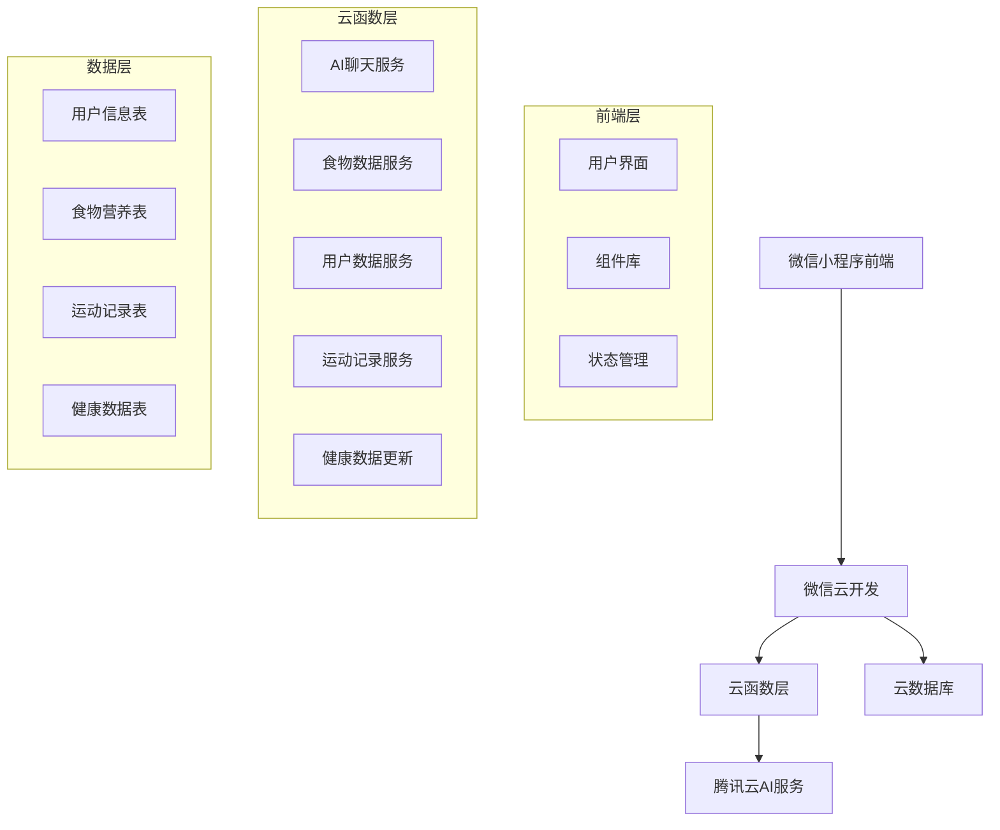
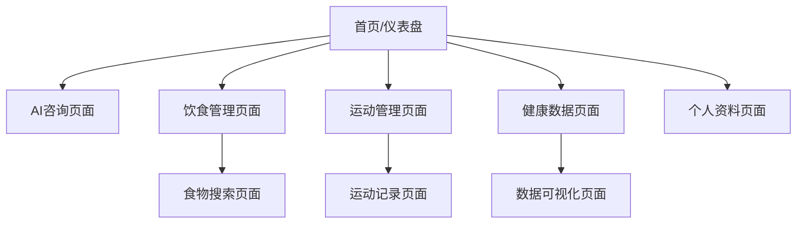
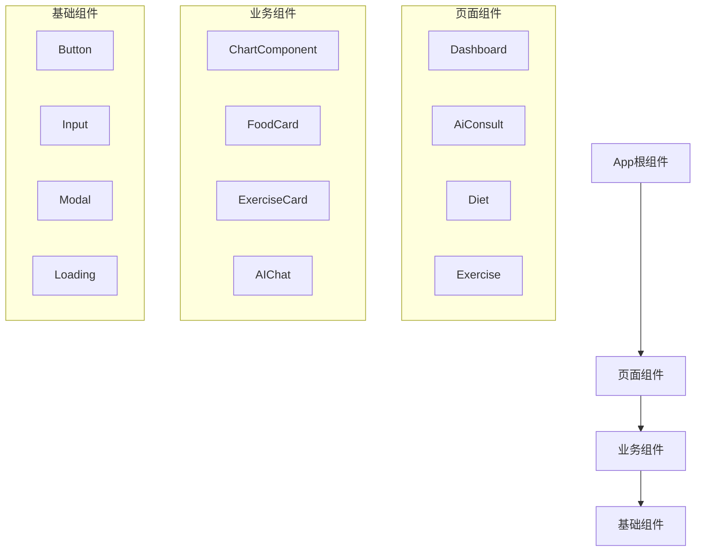
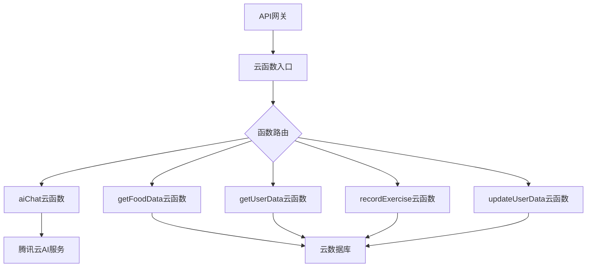
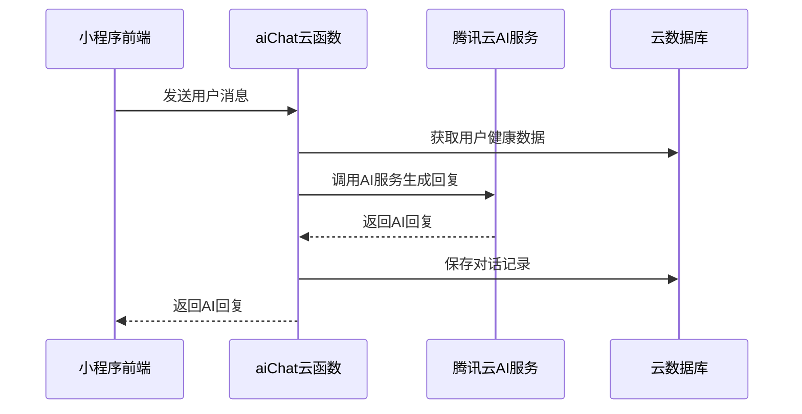
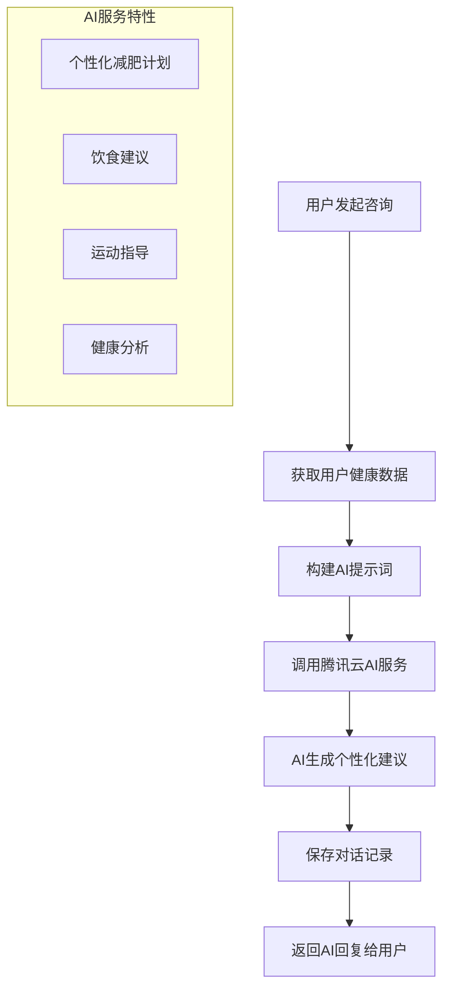
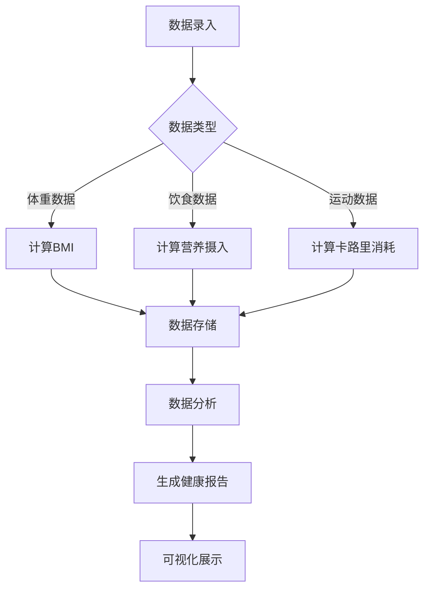

# AI健康减肥微信小程序设计文档

## 1. 项目概述

### 1.1 项目背景
AI健康减肥小程序是一款基于微信小程序平台的健康管理应用，结合人工智能技术，为用户提供个性化的减肥计划、饮食建议和运动指导。

### 1.2 目标用户
- 有健康管理需求的用户
- 希望通过科学方式减肥的人群
- 需要个性化指导的健康管理者

### 1.3 核心价值
提供个性化健康管理方案，解决用户在减肥过程中缺乏专业指导、饮食和运动计划不科学的问题。

## 2. 技术架构

### 2.1 整体架构



### 2.2 技术栈

| 层级 | 技术选型 | 版本 |
|------|----------|------|
| 前端 | 微信小程序原生开发 | 最新版本 |
| 后端 | 微信云开发 | - |
| 运行环境 | Node.js | 18.15.0 |
| 数据库 | 云数据库 | - |
| AI服务 | 腾讯云AI服务 | - |
| 依赖管理 | npm | - |

### 2.3 架构模式
- **前后端分离**: 微信小程序前端 + 云开发后端
- **微服务架构**: 按功能模块拆分云函数
- **事件驱动**: 基于用户操作触发相应服务

## 3. 前端架构

### 3.1 页面结构



### 3.2 核心页面组件

| 页面 | 路径 | 主要功能 |
|------|------|----------|
| 仪表盘 | pages/dashboard | 健康数据概览、快捷操作 |
| AI咨询 | pages/ai-consult | AI聊天服务、个性化建议 |
| 饮食管理 | pages/diet | 饮食记录、营养分析 |
| 运动管理 | pages/exercise | 运动计划、记录统计 |
| 食物搜索 | pages/food-search | 食物营养查询 |
| 健康数据 | pages/health | 体重、BMI等健康指标 |
| 个人资料 | pages/profile | 用户信息、设置 |

### 3.3 组件架构



### 3.4 状态管理

采用微信小程序原生的数据管理方式：
- **页面级状态**: 使用 `this.setData()` 管理页面数据
- **全局状态**: 使用 `app.globalData` 存储用户信息
- **本地存储**: 使用 `wx.setStorageSync()` 持久化关键数据

### 3.5 样式架构

```
styles/
├── base/           # 基础样式
│   ├── reset.wxss
│   └── variables.wxss
├── components/     # 组件样式
├── pages/          # 页面样式
└── utils/          # 工具样式
```

## 4. 后端架构

### 4.1 云函数架构



### 4.2 云函数详细设计

#### 4.2.1 AI聊天服务 (aiChat)



**功能**: 提供AI聊天服务，基于用户健康数据生成个性化建议
**输入参数**:
- `userId`: 用户ID
- `message`: 用户消息
- `sessionId`: 会话ID

**输出**: AI回复内容

#### 4.2.2 食物数据服务 (getFoodData)

**功能**: 获取食物营养信息
**输入参数**:
- `foodName`: 食物名称
- `amount`: 食物重量

**输出**: 食物营养数据（卡路里、蛋白质、脂肪、碳水化合物等）

#### 4.2.3 用户数据服务 (getUserData)

**功能**: 获取用户健康数据
**输入参数**:
- `userId`: 用户ID

**输出**: 用户完整健康档案

#### 4.2.4 运动记录服务 (recordExercise)

**功能**: 记录用户运动数据
**输入参数**:
- `userId`: 用户ID
- `exerciseType`: 运动类型
- `duration`: 运动时长
- `calories`: 消耗卡路里

**输出**: 记录结果状态

#### 4.2.5 健康数据更新服务 (updateUserData)

**功能**: 更新用户健康数据
**输入参数**:
- `userId`: 用户ID
- `healthData`: 健康数据对象

**输出**: 更新结果状态

### 4.3 云函数配置规范

所有云函数遵循以下配置标准：
- Node.js版本: 18.15.0
- wx-server-sdk版本: ~2.6.3
- minimatch依赖版本: ^5.1.0
- 包名规范: 小写字母+连字符（kebab-case）

## 5. 数据模型设计

### 5.1 用户信息表 (users)

| 字段名 | 类型 | 描述 | 必填 |
|--------|------|------|------|
| _id | String | 用户唯一标识 | 是 |
| openid | String | 微信openid | 是 |
| nickname | String | 用户昵称 | 否 |
| avatar | String | 头像URL | 否 |
| gender | Number | 性别(0:未知,1:男,2:女) | 否 |
| age | Number | 年龄 | 否 |
| height | Number | 身高(cm) | 否 |
| targetWeight | Number | 目标体重(kg) | 否 |
| activityLevel | String | 活动水平 | 否 |
| createdAt | Date | 注册时间 | 是 |
| updatedAt | Date | 更新时间 | 是 |

### 5.2 健康数据表 (health_records)

| 字段名 | 类型 | 描述 | 必填 |
|--------|------|------|------|
| _id | String | 记录ID | 是 |
| userId | String | 用户ID | 是 |
| weight | Number | 体重(kg) | 是 |
| bmi | Number | BMI指数 | 否 |
| bodyFat | Number | 体脂率(%) | 否 |
| muscleMass | Number | 肌肉量(kg) | 否 |
| recordDate | Date | 记录日期 | 是 |
| createdAt | Date | 创建时间 | 是 |

### 5.3 饮食记录表 (diet_records)

| 字段名 | 类型 | 描述 | 必填 |
|--------|------|------|------|
| _id | String | 记录ID | 是 |
| userId | String | 用户ID | 是 |
| foodName | String | 食物名称 | 是 |
| amount | Number | 重量(g) | 是 |
| calories | Number | 卡路里 | 是 |
| protein | Number | 蛋白质(g) | 否 |
| fat | Number | 脂肪(g) | 否 |
| carbs | Number | 碳水化合物(g) | 否 |
| mealType | String | 餐次类型 | 是 |
| recordDate | Date | 记录日期 | 是 |
| createdAt | Date | 创建时间 | 是 |

### 5.4 运动记录表 (exercise_records)

| 字段名 | 类型 | 描述 | 必填 |
|--------|------|------|------|
| _id | String | 记录ID | 是 |
| userId | String | 用户ID | 是 |
| exerciseName | String | 运动名称 | 是 |
| duration | Number | 时长(分钟) | 是 |
| intensity | String | 强度级别 | 否 |
| caloriesBurned | Number | 消耗卡路里 | 是 |
| recordDate | Date | 记录日期 | 是 |
| createdAt | Date | 创建时间 | 是 |

### 5.5 AI对话记录表 (chat_records)

| 字段名 | 类型 | 描述 | 必填 |
|--------|------|------|------|
| _id | String | 记录ID | 是 |
| userId | String | 用户ID | 是 |
| sessionId | String | 会话ID | 是 |
| userMessage | String | 用户消息 | 是 |
| aiResponse | String | AI回复 | 是 |
| messageType | String | 消息类型 | 否 |
| createdAt | Date | 创建时间 | 是 |

## 6. 核心功能设计

### 6.1 AI智能咨询功能



### 6.2 健康数据管理



### 6.3 食物营养查询

**功能流程**:
1. 用户输入食物名称
2. 调用getFoodData云函数
3. 查询食物营养数据库
4. 返回营养信息（卡路里、蛋白质、脂肪、碳水化合物）
5. 支持按重量计算营养值

### 6.4 运动记录与分析

**功能特点**:
- 多种运动类型支持
- 自动计算卡路里消耗
- 运动强度分级
- 历史数据统计分析
- 目标达成度追踪

## 7. 用户界面设计

### 7.1 主要界面布局

#### 7.1.1 仪表盘页面
- 今日数据概览（体重、卡路里摄入/消耗）
- 健康趋势图表
- 快捷操作按钮
- AI建议卡片

#### 7.1.2 AI咨询页面
- 聊天对话界面
- 输入框和发送按钮
- 历史对话记录
- 快捷问题模板

#### 7.1.3 饮食管理页面
- 今日饮食记录列表
- 营养摄入统计
- 添加食物按钮
- 营养目标进度条

#### 7.1.4 运动管理页面
- 今日运动记录
- 卡路里消耗统计
- 添加运动按钮
- 运动目标追踪

### 7.2 交互设计原则
- 简洁直观的操作流程
- 一键式快捷操作
- 数据可视化展示
- 个性化用户体验

## 8. API接口设计

### 8.1 云函数接口规范

```json
{
  "requestId": "string",
  "timestamp": "number",
  "data": "object",
  "code": "number",
  "message": "string"
}
```

### 8.2 主要接口定义

#### 8.2.1 AI聊天接口
```
POST /aiChat
Request: {
  "userId": "string",
  "message": "string",
  "sessionId": "string"
}
Response: {
  "reply": "string",
  "suggestions": "array"
}
```

#### 8.2.2 获取食物数据接口
```
GET /getFoodData
Request: {
  "foodName": "string",
  "amount": "number"
}
Response: {
  "nutrition": {
    "calories": "number",
    "protein": "number",
    "fat": "number",
    "carbs": "number"
  }
}
```

#### 8.2.3 记录运动接口
```
POST /recordExercise
Request: {
  "userId": "string",
  "exerciseName": "string",
  "duration": "number",
  "intensity": "string"
}
Response: {
  "recordId": "string",
  "caloriesBurned": "number"
}
```

## 9. 安全与权限设计

### 9.1 用户认证
- 基于微信小程序授权机制
- OpenID作为用户唯一标识
- 云函数统一鉴权处理

### 9.2 数据安全
- 云数据库权限控制
- 用户数据隔离
- 敏感信息加密存储

### 9.3 API安全
- 云函数访问权限控制
- 请求频率限制
- 参数校验和过滤

## 10. 性能优化策略

### 10.1 前端优化
- 图片懒加载
- 分包加载策略
- 缓存机制优化
- 组件按需加载

### 10.2 后端优化
- 云函数冷启动优化
- 数据库查询优化
- 缓存策略实施
- AI服务调用优化

### 10.3 用户体验优化
- 加载状态提示
- 错误处理机制
- 离线数据支持
- 响应式设计

## 11. 测试策略

### 11.1 单元测试
- 云函数逻辑测试
- 组件功能测试
- 工具函数测试

### 11.2 集成测试
- API接口测试
- 数据流测试
- 第三方服务集成测试

### 11.3 用户测试
- 功能可用性测试
- 用户体验测试
- 性能压力测试

## 12. 部署与维护

### 12.1 部署流程
1. 云函数部署: `node deploy-all.js`
2. 小程序代码上传
3. 云数据库初始化
4. 第三方服务配置

### 12.2 监控与日志
- 云函数执行监控
- 错误日志收集
- 性能指标追踪
- 用户行为分析

### 12.3 维护策略
- 定期数据备份
- 安全漏洞修复
- 功能迭代更新
- 用户反馈处理