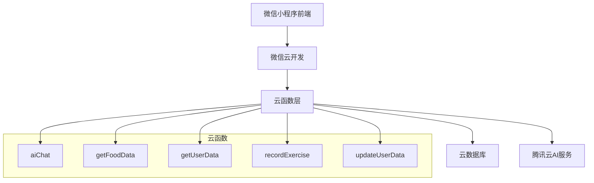
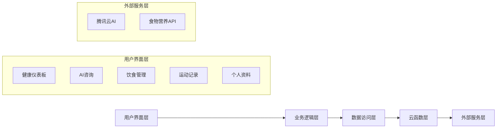
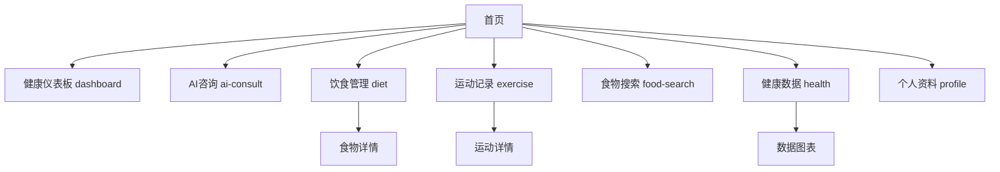
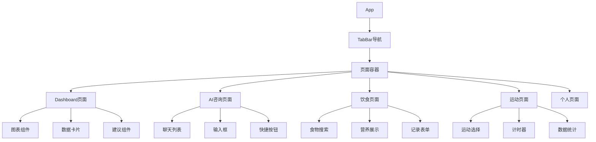
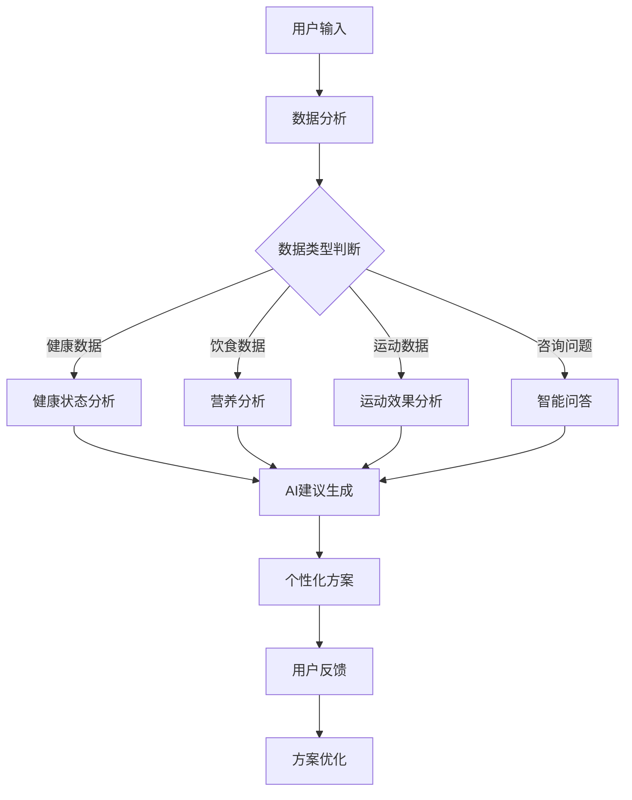
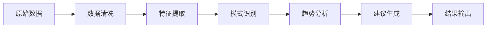
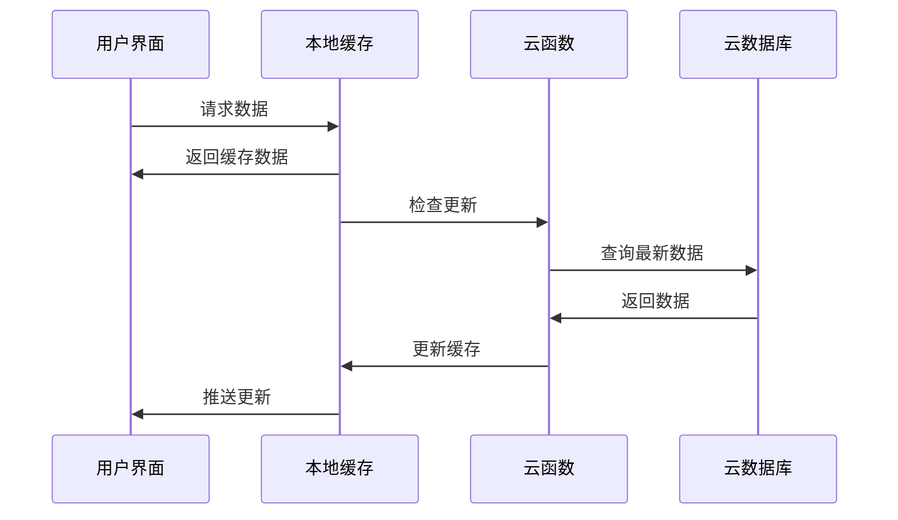
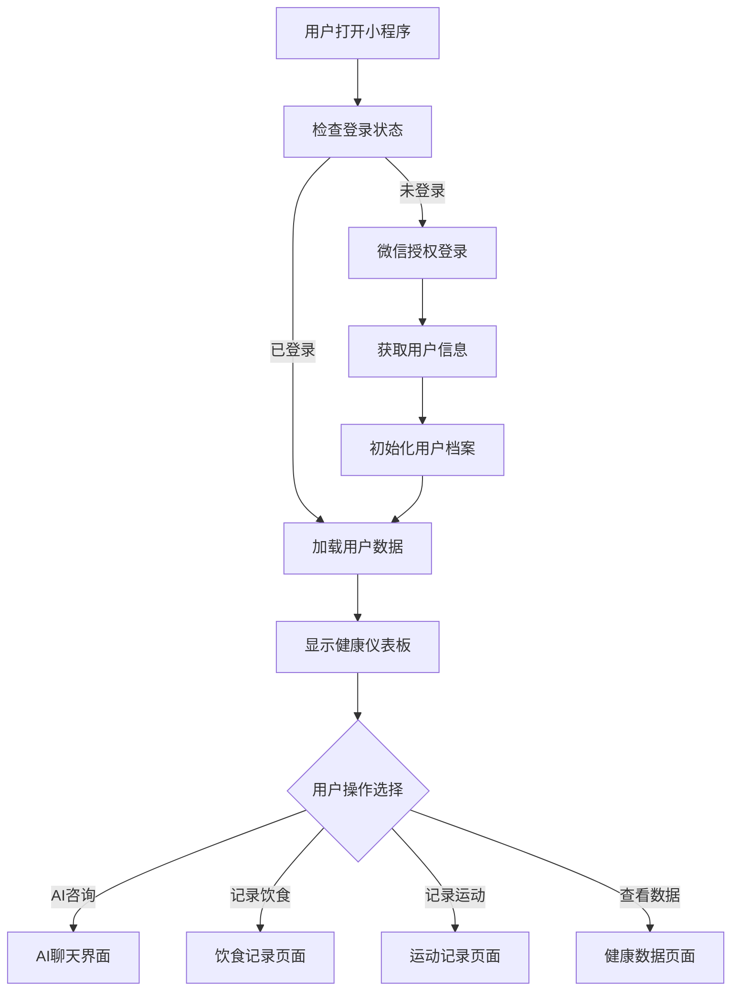

# 微信小程序AI减肥管理功能设计文档

## 1. 概述

### 1.1 项目背景
AI健康减肥小程序是一款基于微信小程序平台的健康管理应用，结合人工智能技术，为用户提供个性化的减肥计划、饮食建议和运动指导。

### 1.2 功能目标
- 提供AI驱动的个性化减肥建议
- 记录和分析用户的饮食、运动数据
- 实时监控用户健康数据变化
- 提供智能化的减肥方案调整

### 1.3 目标用户
有健康管理需求的用户，尤其是希望通过科学方式减肥的人群。

## 2. 技术架构

### 2.1 技术栈
- **前端**: 微信小程序原生开发
- **后端**: 微信云开发
- **数据库**: 云数据库
- **AI服务**: 腾讯云AI服务
- **云函数环境**: Node.js 16.13.0

### 2.2 架构模式


### 2.3 核心模块架构


## 3. 小程序页面架构

### 3.1 页面结构


### 3.2 页面组件定义

#### 3.2.1 健康仪表板组件 (dashboard)
- **功能**: 展示用户整体健康状况和减肥进度
- **数据来源**: getUserData云函数
- **主要元素**:
  - 体重变化趋势图
  - 今日热量摄入/消耗
  - 减肥目标进度
  - AI建议摘要

#### 3.2.2 AI咨询组件 (ai-consult)
- **功能**: 提供智能减肥建议和问答服务
- **数据来源**: aiChat云函数
- **主要元素**:
  - 聊天界面
  - 智能回复
  - 历史对话记录
  - 快速问题模板

#### 3.2.3 饮食管理组件 (diet)
- **功能**: 记录和管理用户饮食
- **数据来源**: getFoodData云函数
- **主要元素**:
  - 每日饮食记录
  - 食物营养信息
  - 热量统计
  - 饮食建议

#### 3.2.4 运动记录组件 (exercise)
- **功能**: 记录用户运动数据
- **数据来源**: recordExercise云函数
- **主要元素**:
  - 运动类型选择
  - 运动时长记录
  - 消耗热量计算
  - 运动计划推荐

### 3.3 组件层次结构


## 4. 云函数API设计

### 4.1 AI聊天服务 (aiChat)
- **功能**: 处理用户与AI的对话交互
- **输入参数**:
  - userMessage: 用户消息内容
  - userId: 用户唯一标识
  - context: 对话上下文
- **返回数据**:
  - aiResponse: AI回复内容
  - suggestions: 相关建议
  - confidence: 回答置信度

### 4.2 食物数据获取 (getFoodData)
- **功能**: 获取食物营养信息
- **输入参数**:
  - foodName: 食物名称
  - quantity: 食用量
- **返回数据**:
  - nutritionInfo: 营养成分信息
  - calories: 热量值
  - recommendations: 食用建议

### 4.3 用户数据获取 (getUserData)
- **功能**: 获取用户健康数据
- **输入参数**:
  - userId: 用户ID
  - dataType: 数据类型 (weight, height, age等)
- **返回数据**:
  - userData: 用户基本信息
  - healthMetrics: 健康指标
  - goals: 减肥目标

### 4.4 运动记录 (recordExercise)
- **功能**: 记录用户运动数据
- **输入参数**:
  - userId: 用户ID
  - exerciseType: 运动类型
  - duration: 运动时长
  - intensity: 运动强度
- **返回数据**:
  - caloriesBurned: 消耗热量
  - recordId: 记录ID
  - achievements: 成就提示

### 4.5 用户数据更新 (updateUserData)
- **功能**: 更新用户健康数据
- **输入参数**:
  - userId: 用户ID
  - updateData: 更新数据对象
- **返回数据**:
  - success: 更新状态
  - newData: 更新后的数据
  - analysis: 数据分析结果

## 5. 数据模型设计

### 5.1 用户信息模型
```javascript
UserProfile: {
  userId: String,
  basicInfo: {
    nickname: String,
    avatar: String,
    gender: String,
    age: Number,
    height: Number
  },
  goals: {
    targetWeight: Number,
    targetDate: Date,
    weeklyGoal: Number
  },
  preferences: {
    dietType: String,
    exerciseLevel: String,
    restrictions: Array
  }
}
```

### 5.2 健康数据模型
```javascript
HealthMetrics: {
  userId: String,
  date: Date,
  weight: Number,
  bmi: Number,
  bodyFat: Number,
  muscleMass: Number,
  waterContent: Number,
  metabolicAge: Number
}
```

### 5.3 饮食记录模型
```javascript
DietRecord: {
  recordId: String,
  userId: String,
  date: Date,
  meals: [{
    mealType: String, // breakfast, lunch, dinner, snack
    foods: [{
      foodName: String,
      quantity: Number,
      unit: String,
      calories: Number,
      nutrition: Object
    }]
  }],
  totalCalories: Number,
  nutritionSummary: Object
}
```

### 5.4 运动记录模型
```javascript
ExerciseRecord: {
  recordId: String,
  userId: String,
  date: Date,
  exercises: [{
    exerciseType: String,
    duration: Number, // minutes
    intensity: String,
    caloriesBurned: Number,
    notes: String
  }],
  totalCaloriesBurned: Number,
  totalDuration: Number
}
```

## 6. 业务逻辑层架构

### 6.1 AI减肥建议引擎


### 6.2 数据分析流程


### 6.3 核心业务功能

#### 6.3.1 智能饮食建议
- 基于用户身体指标和目标计算每日热量需求
- 分析营养素比例，提供均衡饮食建议
- 识别不健康饮食模式，提供改善方案
- 根据用户偏好推荐合适的食物选择

#### 6.3.2 运动计划制定
- 根据用户体能水平制定运动计划
- 监控运动效果，动态调整计划强度
- 提供多样化运动选择，避免单一化
- 设置合理的运动目标和里程碑

#### 6.3.3 进度跟踪分析
- 实时监控体重变化趋势
- 分析减肥速度是否健康合理
- 识别停滞期并提供突破建议
- 生成进度报告和成就展示

## 7. 微信云开发配置

### 7.1 云函数部署配置
```javascript
// 云函数统一配置
{
  runtime: "Nodejs16.13",
  timeout: 20,
  envVariables: {
    AI_API_KEY: "${AI_API_KEY}",
    NUTRITION_API_KEY: "${NUTRITION_API_KEY}"
  },
  vpc: {
    vpcId: "",
    subnetId: ""
  }
}
```

### 7.2 数据库集合设计
- **users**: 用户基本信息
- **health_metrics**: 健康数据记录
- **diet_records**: 饮食记录
- **exercise_records**: 运动记录
- **ai_conversations**: AI对话历史
- **user_goals**: 用户目标设置

### 7.3 云存储资源
- 用户头像图片
- 食物图片库
- 运动示意图
- 数据分析图表缓存

## 8. 状态管理策略

### 8.1 全局状态管理
```javascript
// app.js 全局数据
globalData: {
  userInfo: null,
  isLoggedIn: false,
  currentDate: null,
  todayData: {
    calories: 0,
    exercise: 0,
    weight: 0
  },
  aiContext: []
}
```

### 8.2 页面状态管理
- 使用微信小程序原生的 data 和 setData 方法
- 实现页面间数据传递机制
- 建立数据缓存策略减少云函数调用

### 8.3 数据同步机制


## 9. 用户体验设计

### 9.1 交互流程设计


### 9.2 界面布局规范
- 遵循微信小程序设计规范
- 采用底部Tab导航结构
- 主色调使用健康绿色系
- 确保界面简洁易用，减少学习成本

### 9.3 数据可视化
- 使用ECharts图表组件展示数据趋势
- 提供多种图表类型：折线图、柱状图、饼图
- 支持数据筛选和时间范围选择
- 实现数据导出和分享功能

## 10. 单元测试策略

### 10.1 云函数测试
```javascript
// 测试用例示例
describe('aiChat云函数测试', () => {
  test('正常对话流程', async () => {
    const result = await aiChat.main({
      userMessage: "我今天应该吃什么？",
      userId: "test_user_123"
    });
    expect(result.aiResponse).toBeTruthy();
    expect(result.suggestions).toBeInstanceOf(Array);
  });
  
  test('异常输入处理', async () => {
    const result = await aiChat.main({
      userMessage: "",
      userId: null
    });
    expect(result.error).toBeTruthy();
  });
});
```

### 10.2 前端组件测试
- 组件渲染测试
- 用户交互测试
- 数据绑定测试
- 页面导航测试

### 10.3 集成测试
- 云函数与数据库交互测试
- AI服务集成测试
- 完整用户流程测试
- 性能和稳定性测试

## 11. 部署和发布

### 11.1 开发环境配置
1. 安装Node.js 16.13.0
2. 配置微信开发者工具
3. 设置云开发环境
4. 配置AI服务密钥

### 11.2 云函数部署
```bash
# 一键部署所有云函数
node deploy-all.js

# 单独部署云函数
npm run deploy:aiChat
npm run deploy:getFoodData
npm run deploy:getUserData
npm run deploy:recordExercise
npm run deploy:updateUserData
```

### 11.3 小程序发布流程
1. 代码审查和测试
2. 构建生产版本
3. 上传到微信后台
4. 提交审核
5. 发布上线